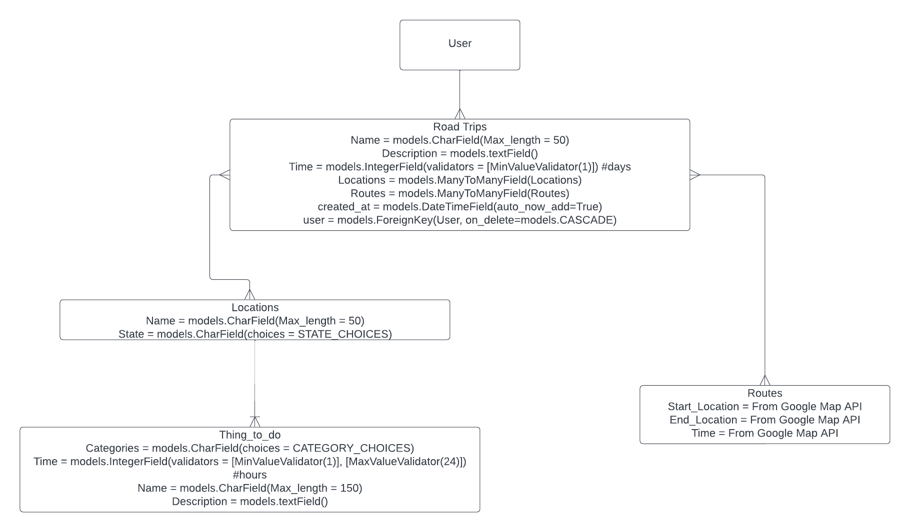
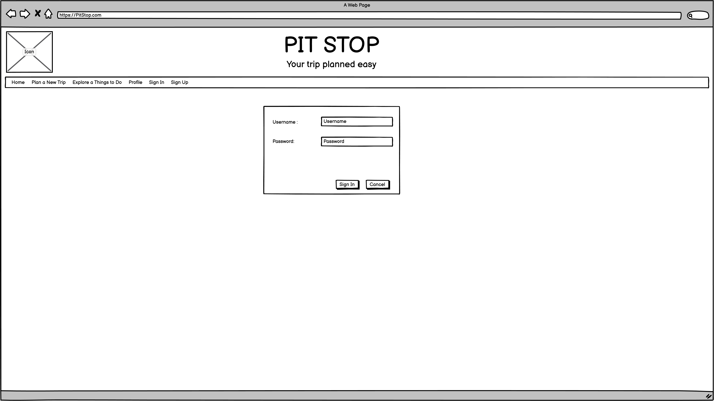
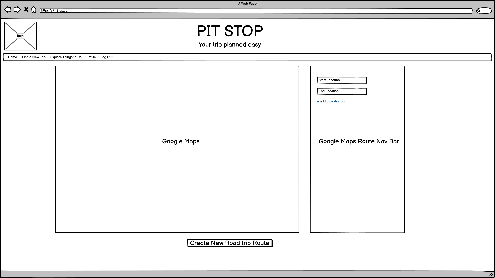
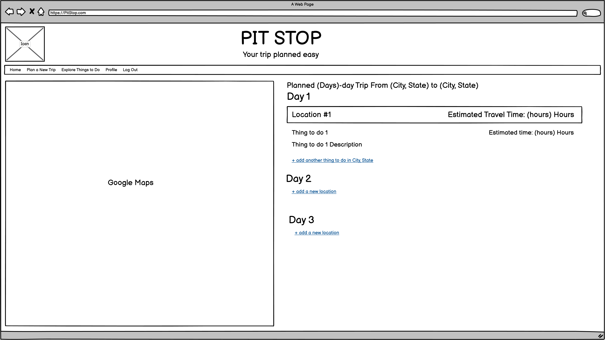
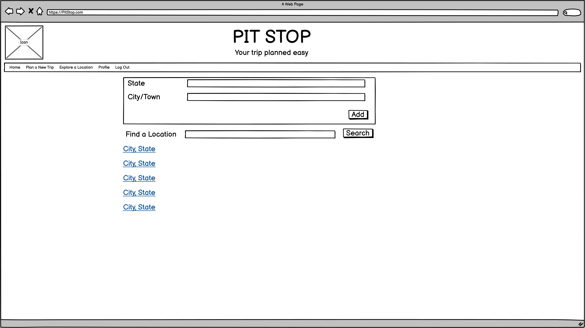
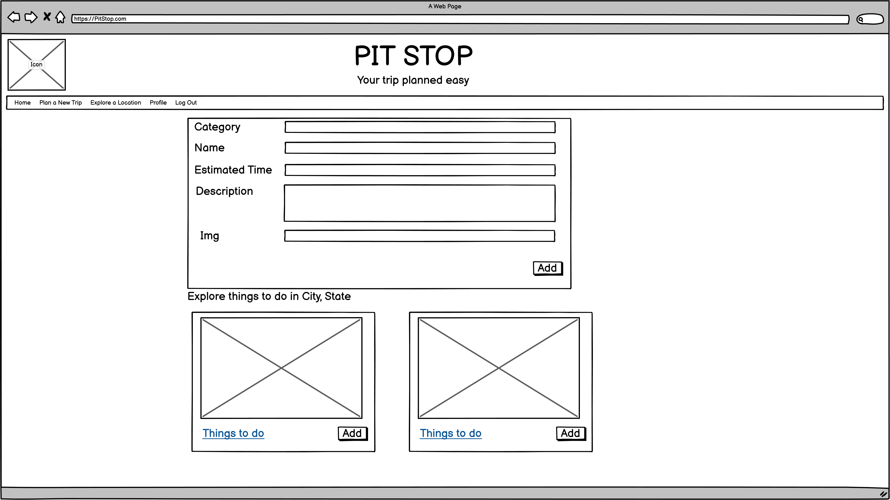
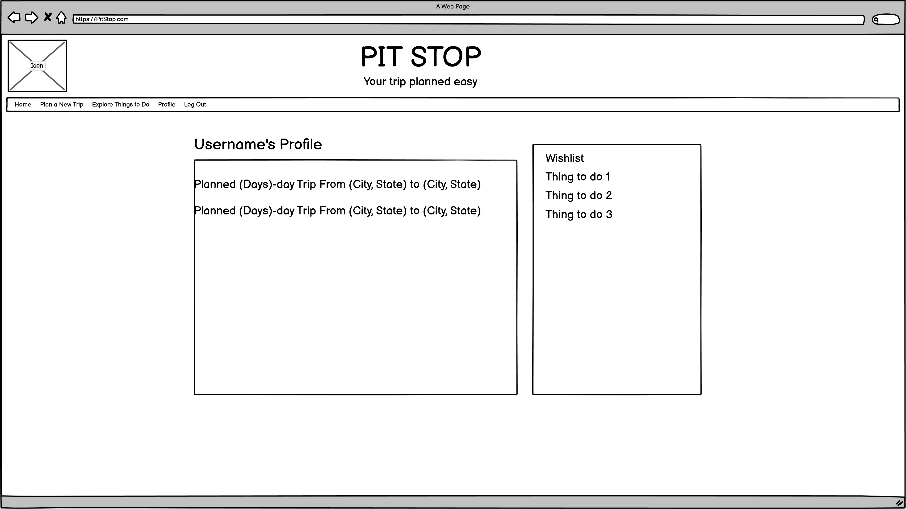
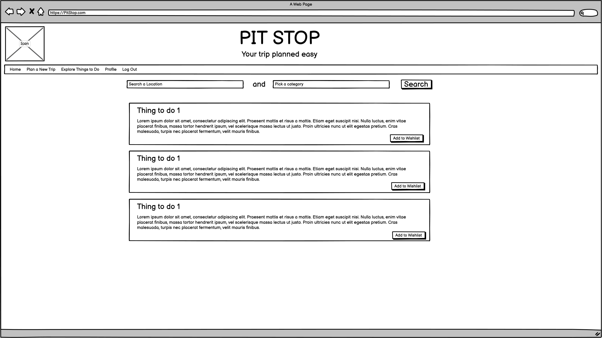

# Road-Trip-Planner

<!-- Table of Contents -->

    
Table of Contents

    <ol>
        <li><a href = "#application-name">Application Name</a></li>
        <li><a href = "#concept">Concept</a>
            <ul><a href = "#future-application-plans">Future Application Plans</a></ul>
        </li>
        <li><a href = "#user-stories">User Stories</a>
            <ul><a href = "#reach-goals">Reach Goals</a></ul>
        </li>
        <li><a href = "#entity-relationship-diagram">Entity Relationship Diagram</a></li>
        <li><a href = "#wireframes">Wireframes</a></li>
        <li><a href = "#technologies-used">Technologies Used</a></li>
        <li><a href = "#additional-information">Additional Information</a></li>
        <li><a href = "#app-demo">App Demo</a></li>
    </ol>

## Application Name: 
Pit Stop

## Concept:
Nobody likes a road trip where they drive from point A to point B in one go. This app was created to help users plan a road trip with possible fun stops with things to do before arriving to a new destination. This application will save your plan and help you keep track of what possible things to do at a certain location, so the user can plan where they want to stop at. 

### Future Application Plans
This application will account for the average mileage of your car so that it can estimate where the user would need to stop for gas and find anything fun to do.

## User Stories
- I want the user to be able plan road trip routes to hit all the good spots before their destination.  
- I want the user to be able to add location items (such as national parks/cities/places to visit) along their route.  
- I want the user to be able to add things to do at each location (hikes, restaurants, museums, and other visitable stuff). These items can be saved in a database so that other users can also see what is available at a certain location.  
- I want the user to be able to search up by location or/and by categories of things to do, to find likable things to do.  
- I want the user to be able to map out how much time it would take for each item on the list and list total time taken so they can make best use of their time during their road trip.  
- I want the user to be able to map out an entire trip per day.  
- I want the user to use a mapping api to figure out drive time/fly time to a destination.  
- I want the user to save their road trips that other people can look up if they need inspiration.  
- I want the user to be able to create and account and sign in and log out.  

Reach Goals:

- I want the user to be able to follow other users if they create great road trips.  
- I want the user to like other users road trip plans and display the most liked plans on top of home page.  

## Entity Relationship Diagram:

## Wireframes:

## Technologies Used:
* [Django](http://djangoproject.com)
* [Python](http://python.org)
* [React](https://reactjs.org/)
* [Javascript](https://www.javascript.com/)
* [PostgreSQL](https://www.postgresql.org/)
* [CSS](https://en.wikipedia.org/wiki/CSS)
* [HTML](https://www.w3schools.com/html/)

## Additional information:
Developed by Dominick  
Linkedin: https://www.linkedin.com/in/dominick-chiang-e-i-t-30751182/

## App Demo

https://github.com/chiangd233/Road-Trip-Planner/
